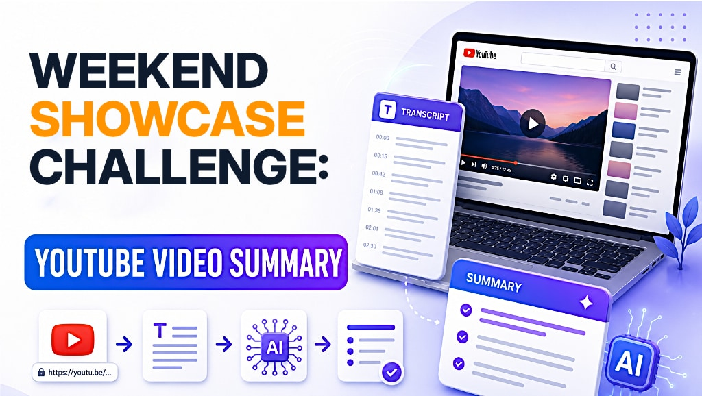
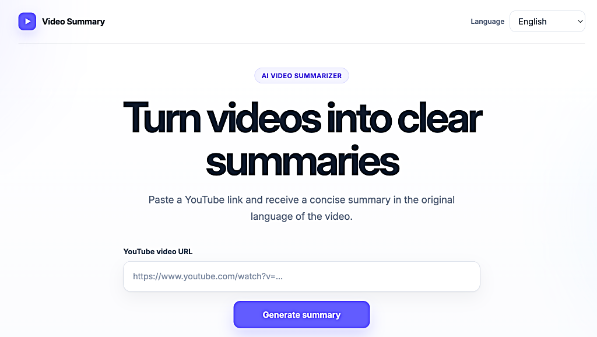
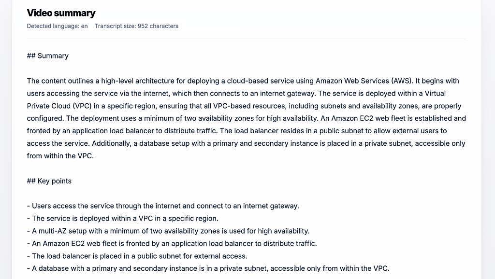
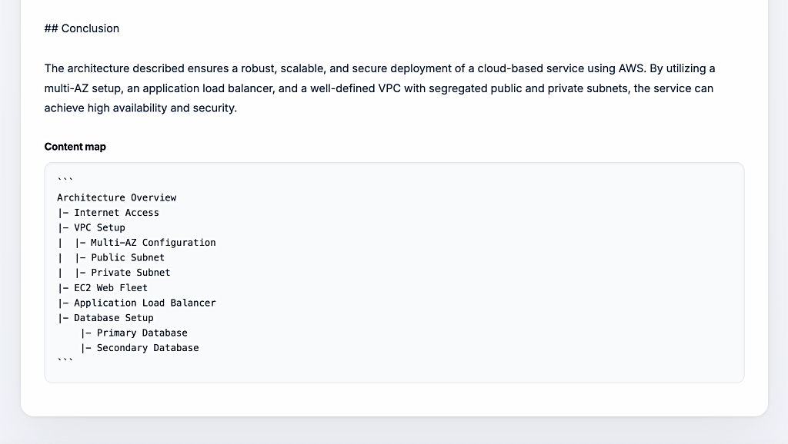
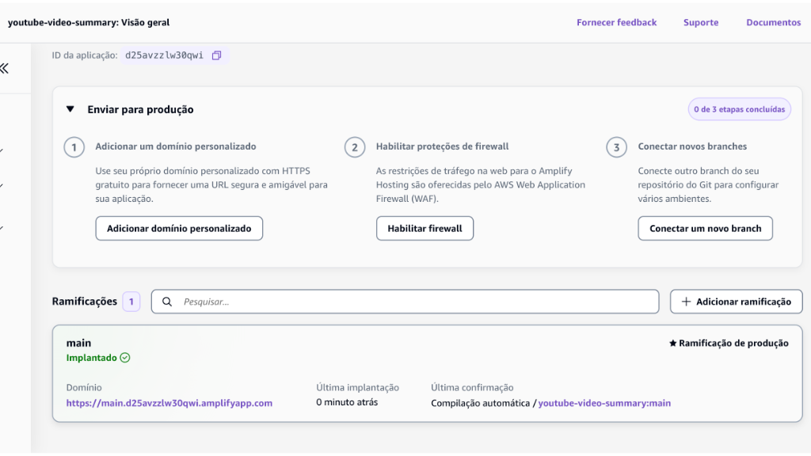
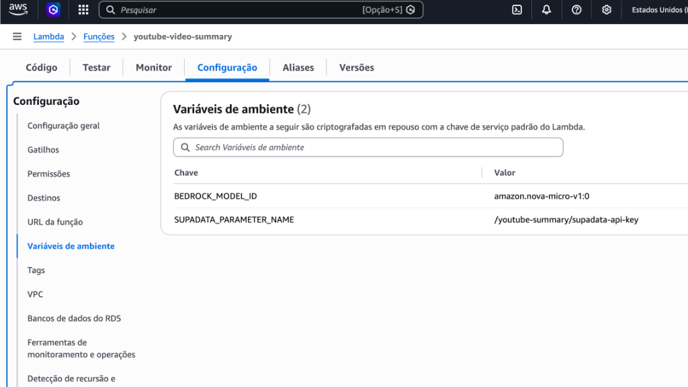
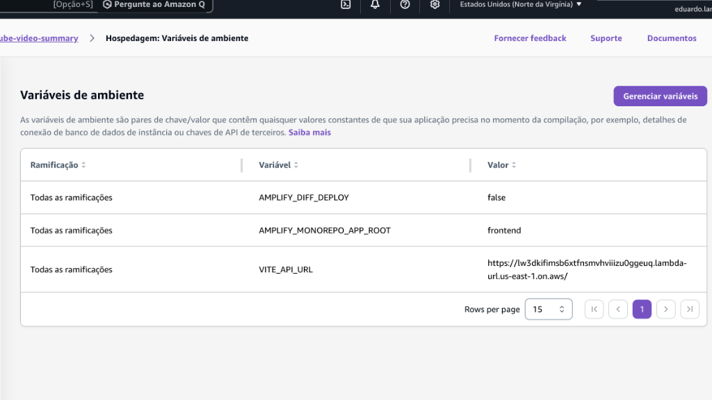
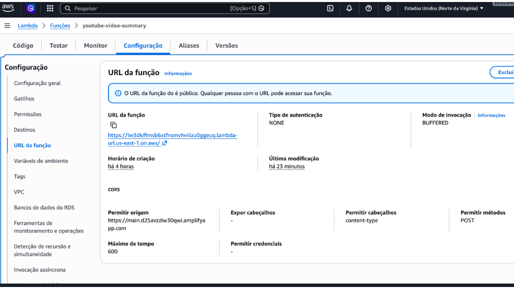
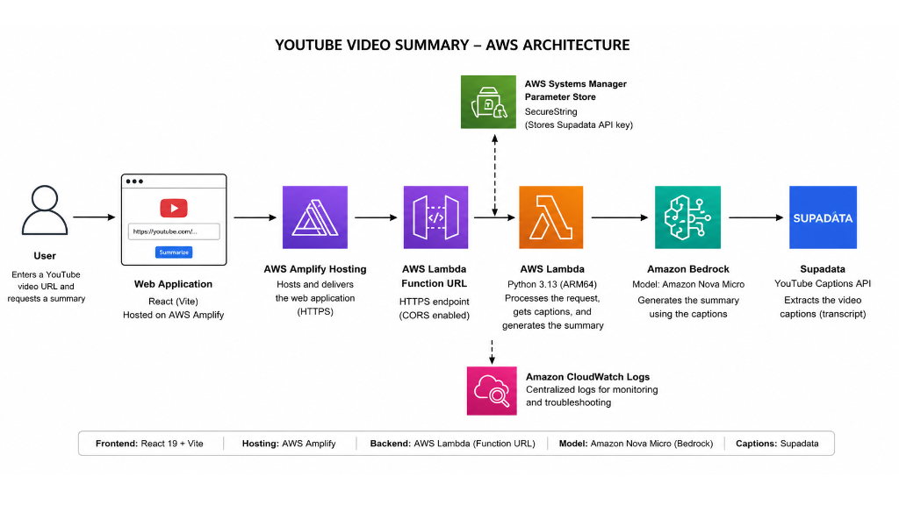

# Weekend Annoying Task Challenge: YouTube Video Summary

🌐 **Language:** **English** \| [Português](README.pt-BR.md)




| Property | Value |
|---|---|
| AWS Region | `us-east-1` |
| AI Model | Amazon Nova Micro |
| Runtime | Python 3.13 |
| Frontend | React 19 / Vite 8 |
| Backend | AWS Lambda |
| API | AWS Lambda Function URL |
| Infrastructure as Code | AWS SAM / AWS CloudFormation |
| Transcript Provider | Supadata |
| Secret Storage | AWS Systems Manager Parameter Store |
| Hosting | AWS Amplify Hosting |

AI-powered serverless application built for the **Weekend Showcase Challenge: YouTube Video Summary**.

YouTube Video Summary accepts a YouTube URL, retrieves the available transcript, identifies its original language, and uses Amazon Bedrock to generate a clear, structured summary in that same language.

The app interface is available in English and Brazilian Portuguese. English is selected by default.

---

## Vision & What the App Does

Watching a long YouTube video before knowing whether it is useful can waste valuable time.

The idea for **YouTube Video Summary** came from movie trailers. A trailer helps someone decide whether a two-hour movie is worth watching. I wanted the same decision shortcut for YouTube videos.

Instead of immediately spending 30 minutes or more watching a video, the user can first read a structured summary and decide whether the full content is relevant.

The user pastes a public YouTube URL. The application retrieves the available transcript, identifies its language, and generates a summary in that same language.



The application provides:

- a concise summary;
- the main points;
- a conclusion;
- an ASCII content map;
- the detected transcript language;
- the transcript character count;
- an interface in English and Brazilian Portuguese.



In addition to the written summary, the application generates an ASCII content map that organizes the central topic, main topics, and their subtopics.



---

## How I Built It

I started by defining the smallest architecture that could satisfy the challenge without adding unnecessary infrastructure.

The frontend was built with **React 19** and **Vite 8**. It is hosted with **AWS Amplify Hosting** and communicates with the backend through an **AWS Lambda Function URL**.



The backend was developed in **Python 3.13** and deployed with **AWS SAM**. The Lambda function:

1. validates the HTTP request;
2. validates the YouTube URL;
3. retrieves the Supadata API key from AWS Systems Manager Parameter Store;
4. requests the public transcript from Supadata;
5. identifies the transcript language;
6. invokes Amazon Nova Micro through Amazon Bedrock;
7. returns the structured summary, content map, and transcript to the frontend.

### Key decisions

I chose a serverless architecture to reduce cost, simplify deployment, and make the environment easy to remove after the challenge.

The project does not use:

- Amazon EC2;
- containers;
- Elastic Load Balancing;
- Amazon API Gateway;
- a database;
- persistent transcript storage;
- provisioned concurrency;
- active AWS X-Ray tracing.

Amazon Nova Micro was selected because it is appropriate for text summarization and supports a lower-cost architecture.

The Supadata API key is stored as a `SecureString` in AWS Systems Manager Parameter Store instead of being placed in the frontend or committed to GitHub.



The Lambda execution role follows least-privilege principles. It can invoke only the selected Amazon Nova Micro model and retrieve only the required Parameter Store value.

### Challenges and how I solved them

#### Retrieving YouTube captions

The first challenge was obtaining public captions reliably from a cloud-hosted backend. Direct transcript approaches can be blocked or restricted, while the official YouTube captions workflow is designed around authorized access.

I solved this by integrating [Supadata](https://supadata.ai/) as the transcript provider.

#### Returning summaries in the correct language

Another challenge was the model did not always preserve the transcript language consistently.

I updated the backend prompt to define:

- the mandatory output language;
- mandatory headings;
- exact formatting rules;
- low inference temperature;
- structured output requirements.

English transcripts now use:

```text
## Summary
## Key points
## Conclusion
## Content Map
```

Portuguese transcripts use:

```text
## Resumo
## Principais pontos
## Conclusão
## Mapa de conteúdo
```

#### Connecting Amplify to the backend

The frontend reads the Lambda Function URL from the Amplify environment variable:

```text
VITE_API_URL
```



CORS on the Lambda Function URL is restricted to the production Amplify domain.



#### Controlling request size and model usage

The MVP limits transcripts to:

```text
80,000 characters
```

The Amazon Bedrock response is limited to 1,500 output tokens, and the model temperature is set to `0.1` for more consistent results.

---

## AWS Services Used / Architecture Overview

### AWS services

| AWS Service | Purpose |
|---|---|
| AWS Amplify Hosting | Hosts and deploys the React and Vite frontend |
| AWS Lambda | Processes the request, retrieves the transcript, invokes Amazon Bedrock, and returns the result |
| AWS Lambda Function URL | Provides the HTTPS endpoint used by the frontend |
| Amazon Bedrock | Provides generative AI inference through the Converse API |
| Amazon Nova Micro | Generates the structured video summary |
| AWS Systems Manager Parameter Store | Stores the Supadata API key as a `SecureString` |
| AWS Identity and Access Management | Provides least-privilege permissions for the Lambda execution role |
| AWS CloudFormation and AWS SAM | Define and deploy the backend infrastructure |

### External service

| Service | Purpose |
|---|---|
| Supadata | Retrieves the public YouTube transcript and identifies its language |

### How the application is triggered

The application is triggered when the user:

1. opens the React application hosted on AWS Amplify;
2. enters a YouTube URL;
3. selects **Summarize**.

The browser sends an HTTPS `POST` request to the Lambda Function URL. This request invokes the AWS Lambda function.

The Lambda function retrieves the transcript through Supadata, sends it to Amazon Nova Micro through Amazon Bedrock, and returns the generated summary to the frontend.

### Architecture flow

```text
User
  |
  v
React + Vite web application
  |
  v
AWS Amplify Hosting
  |
  | HTTPS POST
  v
AWS Lambda Function URL
  |
  v
AWS Lambda
  |
  +--> AWS Systems Manager Parameter Store
  |       Supadata API key
  |
  +--> Supadata
  |       YouTube transcript and language
  |
  +--> Amazon Bedrock
          Amazon Nova Micro summary

```

### Architecture diagram



---

## Repository Structure

```text
youtube-video-summary/
├── backend/
│   ├── app.py
│   └── requirements.txt
├── frontend/
│   ├── public/
│   ├── src/
│   ├── package-lock.json
│   ├── package.json
│   └── vite.config.js
├── images/
├── .gitignore
├── LICENSE
├── README.md
├── README.pt-BR.md
├── samconfig.toml
└── template.yaml
```

The backend infrastructure is defined in `template.yaml` and deployed with AWS SAM. The frontend is a separate Vite application inside the `frontend` directory.

---

## Deployment and Installation

> [!IMPORTANT]
> This project creates AWS resources that can generate charges. The Lambda Function URL uses `AuthType: NONE`, which makes the endpoint publicly accessible. Deploy the application only for controlled testing, restrict CORS to origins you own, and remove the environment when it is no longer required.

### Prerequisites

Before starting, install or prepare:

- an AWS account;
- an administrator identity that can create an IAM policy, an IAM user, and an access key;
- [AWS CLI version 2](https://docs.aws.amazon.com/cli/latest/userguide/getting-started-install.html);
- [AWS SAM CLI](https://docs.aws.amazon.com/serverless-application-model/latest/developerguide/install-sam-cli.html);
- Git;
- Python 3.13;
- a GitHub account to create a fork of the repository;
- a [Supadata](https://supadata.ai/) account and API key;
- permission to invoke Amazon Nova Micro in `us-east-1`.

The included `samconfig.toml` configures the CloudFormation stack as `youtube-video-summary` in `us-east-1` and enables automatic resolution of the deployment S3 bucket.

### 1. Create a dedicated IAM user for the project

Use an administrator identity to create a dedicated IAM user named:

```text
youtube-video-summary
```

This user is intended only for programmatic deployment and cleanup commands for this project. Do not create access keys for the AWS account root user.

> [!NOTE]
> Keep the access key private, never commit it to GitHub, and delete the key and user after removing the project.

#### Create the customer managed policy

1. Open the AWS Identity and Access Management console.
2. Copy your 12-digit AWS account ID from the account menu.
3. Open **Policies** and select **Create policy**.
4. Select the **JSON** editor.
5. Paste the policy below.
6. Replace every occurrence of `YOUR_AWS_ACCOUNT_ID` with your 12-digit AWS account ID, without hyphens.
7. Create the policy with the name `YouTubeSummarySamIamDeployment`.

```json
{
    "Version": "2012-10-17",
    "Statement": [
        {
            "Sid": "ManageProjectLambdaRole",
            "Effect": "Allow",
            "Action": [
                "iam:CreateRole",
                "iam:DeleteRole",
                "iam:GetRole",
                "iam:UpdateAssumeRolePolicy",
                "iam:PutRolePolicy",
                "iam:GetRolePolicy",
                "iam:DeleteRolePolicy",
                "iam:ListRolePolicies",
                "iam:ListAttachedRolePolicies",
                "iam:TagRole",
                "iam:UntagRole"
            ],
            "Resource": "arn:aws:iam::YOUR_AWS_ACCOUNT_ID:role/youtube-video-summary-*"
        },
        {
            "Sid": "AttachProjectRolePolicies",
            "Effect": "Allow",
            "Action": [
                "iam:AttachRolePolicy",
                "iam:DetachRolePolicy"
            ],
            "Resource": "arn:aws:iam::YOUR_AWS_ACCOUNT_ID:role/youtube-video-summary-*"
        },
        {
            "Sid": "PassProjectRoleToLambda",
            "Effect": "Allow",
            "Action": "iam:PassRole",
            "Resource": "arn:aws:iam::YOUR_AWS_ACCOUNT_ID:role/youtube-video-summary-*",
            "Condition": {
                "StringEquals": {
                    "iam:PassedToService": "lambda.amazonaws.com"
                }
            }
        },
        {
            "Sid": "ReadDeploymentPolicy",
            "Effect": "Allow",
            "Action": [
                "iam:GetPolicy",
                "iam:GetPolicyVersion",
                "iam:ListPolicyVersions"
            ],
            "Resource": "arn:aws:iam::YOUR_AWS_ACCOUNT_ID:policy/YouTubeSummarySamIamDeployment"
        },
        {
            "Sid": "ViewOwnUserPolicies",
            "Effect": "Allow",
            "Action": [
                "iam:GetUser",
                "iam:ListAttachedUserPolicies",
                "iam:ListUserPolicies",
                "iam:GetUserPolicy",
                "iam:ListGroupsForUser"
            ],
            "Resource": "arn:aws:iam::YOUR_AWS_ACCOUNT_ID:user/youtube-video-summary"
        },
        {
            "Sid": "ReadCloudTrailDeploymentEvents",
            "Effect": "Allow",
            "Action": "cloudtrail:LookupEvents",
            "Resource": "*"
        }
    ]
}
```

#### Create the IAM user and attach the policies

1. In the IAM console, open **Users** and select **Create user**.
2. Enter `youtube-video-summary` as the user name.
3. Do not enable AWS Management Console access for this user.
4. Under permissions, select **Attach policies directly**.
5. Attach the AWS managed policy `PowerUserAccess`.
6. Attach the customer managed policy `YouTubeSummarySamIamDeployment`.
7. Create the user.
8. Open the new user and select **Security credentials**.
9. Under **Access keys**, select **Create access key**.
10. Select **Command Line Interface (CLI)** as the use case.
11. Create the key and securely save the **Access key ID** and **Secret access key**. The secret is displayed only once.

`PowerUserAccess` provides broad access to AWS services and resources but does not provide the IAM permissions needed to manage the project Lambda execution role. The `YouTubeSummarySamIamDeployment` policy supplies only the additional IAM actions used by this AWS SAM deployment.

### 2. Configure the project AWS CLI profile

Configure a named profile with the access key created for the dedicated user:

```bash
aws configure --profile youtube-video-summary
```

Enter:

```text
AWS Access Key ID: YOUR_ACCESS_KEY_ID
AWS Secret Access Key: YOUR_SECRET_ACCESS_KEY
Default region name: us-east-1
Default output format: json
```

Confirm the configured identity:

```bash
aws sts get-caller-identity --profile youtube-video-summary
```

Verify that the returned ARN contains `user/youtube-video-summary` and that the account ID is correct. The AWS CLI and AWS SAM commands in this guide explicitly use this named profile when accessing AWS.

### 3. Fork and clone the repository

Create a fork of this repository in your GitHub account. Then, clone your fork by replacing YOUR_USERNAME with your GitHub username:

```bash
git clone https://github.com/YOUR_USERNAME/youtube-video-summary.git 
cd youtube-video-summary
```

Confirm that the remote repository points to your fork:

```bash
git remote -v
```

The URL displayed for origin should include your GitHub username.

### 4. Create a Supadata account and store the API key

This application uses Supadata to retrieve the public YouTube transcript before sending the text to Amazon Bedrock. Create a [Supadata](https://supadata.ai/) account, copy the API key from your account, and store it in AWS Systems Manager Parameter Store:

```bash
aws ssm put-parameter \
  --name "/youtube-summary/supadata-api-key" \
  --value "YOUR_SUPADATA_API_KEY" \
  --type "SecureString" \
  --region "us-east-1" \
  --profile youtube-video-summary
```

Replace `YOUR_SUPADATA_API_KEY` with your Supadata API key. The parameter must exist in `us-east-1`. To replace an existing value, repeat the command with `--overwrite`.

> [!NOTE]
> Do not commit the Supadata API key to the repository or expose it through a Vite environment variable.

### 5. Validate and build the backend

From the repository root, run:

```bash
sam validate --lint
sam build
```

The lint option validates the AWS SAM template with CloudFormation Linter. The build output is created in `.aws-sam/`, which is excluded from Git.

### 6. Initially deploy the backend

The Amplify production domain does not exist yet. For this first deployment, use `https://example.invalid` as a temporary origin. This reserved domain does not match the frontend and prevents a browser origin from being authorized before the Amplify app is created.

Deploy the application:

```bash
sam deploy \
  --stack-name youtube-video-summary \
  --region us-east-1 \
  --capabilities CAPABILITY_IAM \
  --parameter-overrides \
    ParameterKey=AllowedOrigin,ParameterValue=https://example.invalid \
  --profile youtube-video-summary
```

Review the CloudFormation change set and confirm the deployment when prompted. AWS SAM creates the `youtube-video-summary` CloudFormation stack, Lambda function, and Lambda Function URL.

The temporary value restricts browser CORS, but it does not authenticate clients or prevent direct requests to the public Function URL.

### 7. Retrieve the Lambda Function URL

After the deployment completes, obtain the endpoint from the CloudFormation output:

```bash
FUNCTION_URL=$(aws cloudformation describe-stacks \
  --stack-name "youtube-video-summary" \
  --region "us-east-1" \
  --query "Stacks[0].Outputs[?OutputKey=='VideoSummaryFunctionUrl'].OutputValue" \
  --output text \
  --profile youtube-video-summary)

echo "$FUNCTION_URL"
```

The value should follow this format:

```text
https://<url-id>.lambda-url.us-east-1.on.aws/
```

Copy the displayed value. You will use it as the value of the `VITE_API_URL` environment variable when creating the Amplify app. Each deployment that creates a new Function URL receives a different identifier.

### 8. Test the deployed backend directly

You can also send a request directly from the terminal. This optional test verifies the backend without using the frontend.

```bash
curl -sS -X POST "$FUNCTION_URL" \
  -H "Content-Type: application/json" \
  -d '{"url":"https://www.youtube.com/watch?v=VIDEO_ID"}'
```

Replace `VIDEO_ID` with a public YouTube video that has an available transcript.

### 9. Deploy the frontend with AWS Amplify Hosting

Sign in to the AWS Management Console using an identity with permission to create and configure applications in AWS Amplify Hosting:

1. open the AWS Amplify console in `us-east-1`;
2. select **Create new app**;
3. choose GitHub as the repository provider and select Next;
4. authorize AWS Amplify to access your GitHub account;
5. select your fork and the main branch;
6. indicate that the repository is a monorepo;
7. set the application root to `frontend`;
8. expand **Advanced settings**;
9. under **Environment variables**, select **Add new**;
10. enter `VITE_API_URL` as the key;
11. paste the Lambda Function URL retrieved in step 7 as the value;
12. use `youtube-video-summary` as the application name;
13. create the application and start the deployment.

After the application is created, open **Hosting** and **Build settings**. Verify that the automatically detected specification matches the configuration below. Edit it and start a new deployment only if it is different.

```yaml
version: 1
applications:
  - frontend:
      phases:
        preBuild:
          commands:
            - npm ci --cache .npm --prefer-offline
        build:
          commands:
            - npm run build
      artifacts:
        baseDirectory: dist
        files:
          - '**/*'
      cache:
        paths:
          - .npm/**/*
    appRoot: frontend
```

This build specification is configured directly in AWS Amplify Hosting and does not need to be stored as an `amplify.yml` file in the repository.

Amplify environment variables are available during the build. Because Vite bundles `VITE_API_URL` into the frontend, a future change to this variable requires a new frontend deployment.

### 10. Restrict CORS to your Amplify domain

After the deployment finishes, copy the complete main branch domain provided by Amplify, without the trailing slash. The address follows this format:

```text
https://main.YOUR_APP_ID.amplifyapp.com
```

Set the origin by replacing `YOUR_APP_ID` with the actual identifier displayed by Amplify:

```bash
AMPLIFY_ORIGIN="https://main.YOUR_APP_ID.amplifyapp.com"
echo "$AMPLIFY_ORIGIN"
```

Deploy the backend again with the final origin:

```bash
sam deploy \
  --stack-name youtube-video-summary \
  --region us-east-1 \
  --capabilities CAPABILITY_IAM \
  --parameter-overrides \
    ParameterKey=AllowedOrigin,ParameterValue="$AMPLIFY_ORIGIN" \
  --profile youtube-video-summary
```

This second deployment changes only the parameter used by CORS. You do not need to edit `template.yaml` or run `sam build` again.

Do not use `*` for a public deployment. CORS restricts browser origins, but it does not authenticate callers or prevent direct requests to the public Function URL.

### 11. Validate CORS

Confirm the configuration registered on the Function URL:

```bash
aws lambda get-function-url-config \
  --function-name youtube-video-summary \
  --region us-east-1 \
  --profile youtube-video-summary \
  --query "Cors" \
  --output yaml
```

The result must show the complete Amplify domain under `AllowOrigins`, along with `POST` under `AllowMethods` and `content-type` under `AllowHeaders`.

Also test the browser preflight request:

```bash
curl -i -X OPTIONS "$FUNCTION_URL" \
  -H "Origin: $AMPLIFY_ORIGIN" \
  -H "Access-Control-Request-Method: POST" \
  -H "Access-Control-Request-Headers: content-type"
```

The response must return `HTTP 200` and the `Access-Control-Allow-Origin`, `Access-Control-Allow-Methods`, and `Access-Control-Allow-Headers` headers with the configured values.

### 12. Test the production application

Open the Amplify domain and confirm that:

- the page loads correctly;
- a valid YouTube URL generates a summary;
- the summary uses the transcript language;
- invalid URLs display an error;
- requests from an unauthorized browser origin are blocked by CORS.

---

## Updating the Application

### Backend or infrastructure changes

Use this workflow after changing:

- `backend/app.py`;
- `backend/requirements.txt`;
- `template.yaml`;
- `samconfig.toml`.

From the repository root, run:

```bash
sam validate --lint
sam build
ALLOWED_ORIGIN=$(aws lambda get-function-url-config \
  --function-name youtube-video-summary \
  --region us-east-1 \
  --profile youtube-video-summary \
  --query "Cors.AllowOrigins[0]" \
  --output text)
sam deploy \
  --stack-name youtube-video-summary \
  --region us-east-1 \
  --capabilities CAPABILITY_IAM \
  --parameter-overrides \
    ParameterKey=AllowedOrigin,ParameterValue="$ALLOWED_ORIGIN" \
  --profile youtube-video-summary
```

The deployment updates the existing `youtube-video-summary` CloudFormation stack and preserves the currently allowed origin.

### Frontend changes

Files such as `frontend/src/App.jsx`, `frontend/src/App.css`, and other files under `frontend/` are not deployed by AWS SAM. After making a change, commit it and push it to the GitHub branch connected to AWS Amplify:

```bash
git add frontend
git commit -m "Update frontend"
git push
```

AWS Amplify automatically builds and deploys the connected branch when automatic builds are enabled. You do not need to run `sam build` or `sam deploy` when only `App.jsx` or another frontend file changes.

If the Lambda Function URL changes, update `VITE_API_URL` in the AWS Amplify environment variables and start a new deployment.

---

## Cleanup

Remove the environment when it is no longer required. Keep the dedicated IAM user active until all CLI-based cleanup commands are complete.

### 1. Delete the AWS Amplify application

In the AWS Amplify console:

1. open the application;
2. open the application settings;
3. select **Delete app**;
4. confirm the deletion.

This removes the hosted frontend and its Amplify domain.

### 2. Delete the AWS SAM application

From the repository root, run:

```bash
sam delete \
  --stack-name "youtube-video-summary" \
  --region "us-east-1" \
  --profile youtube-video-summary
```

Confirm the deletion when prompted.

AWS SAM deletes the `youtube-video-summary` CloudFormation stack and the resources managed by it, including the Lambda function, Lambda Function URL, and Lambda execution role. Do not delete the same application stack separately in the AWS CloudFormation console.

### 3. Delete the Supadata parameter

```bash
aws ssm delete-parameter \
  --name "/youtube-summary/supadata-api-key" \
  --region "us-east-1" \
  --profile youtube-video-summary
```

### 4. Delete the dedicated IAM user and policy

After deleting the application resources, sign in with the administrator identity used to create the project user.

In the IAM console:

1. open **Users** and select `youtube-video-summary`;
2. delete its access key;
3. detach `PowerUserAccess` and `YouTubeSummarySamIamDeployment`;
4. delete the `youtube-video-summary` user;
5. open **Policies** and delete `YouTubeSummarySamIamDeployment`.

> [!NOTE]
> AWS SAM may create a shared CloudFormation stack named `aws-sam-cli-managed-default` for deployment artifacts. It is separate from the `youtube-video-summary` application stack. Keep it if other AWS SAM projects use it or if you plan to deploy with AWS SAM again. Delete it only after confirming that it is no longer required by another project.

---

## What I Learned

This challenge reinforced the importance of starting with the minimum architecture required to solve the problem.

I learned how to:

- deploy a Python backend with AWS SAM;
- expose a Lambda function through a Lambda Function URL;
- connect an AWS Amplify frontend to a serverless backend;
- configure production CORS correctly;
- store an external API key securely in Parameter Store;
- apply least-privilege IAM permissions;
- invoke Amazon Nova Micro through the Amazon Bedrock Converse API;
- control model output using language rules, fixed headings, token limits, and low temperature;
- design an application that does not require a database;
- balance simplicity, security, cost, and usability in a weekend project.

I also learned that the smallest working architecture is not always the first architecture considered. Several services and features were intentionally removed because they were not required for the MVP.

The final result is a focused serverless application that solves one repetitive task: deciding whether a YouTube video is worth watching before investing the time to watch it.

---

## License

This project is licensed under the MIT License. See the [LICENSE](LICENSE) file for details.
