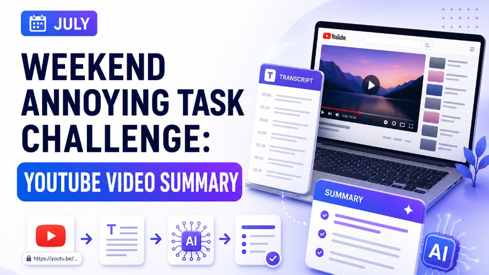

# YouTube Video Summary

🌐 **Language:** **English** \| [Português](README.pt-BR.md)




 


| Property | Value |
|---|---|
| AWS Region | `us-east-1` |
| AI Model | Amazon Nova Micro |
| Runtime | Python 3.13 |
| Frontend | React / Vite |
| Backend | AWS Lambda |
| API | Amazon API Gateway HTTP API |
| Infrastructure as Code | AWS SAM / AWS CloudFormation |
| Transcript Provider | Supadata |
| Secret Storage | AWS Systems Manager Parameter Store |
| Hosting | AWS Amplify Hosting |

AI-powered serverless application built for the **AWS Weekend Challenge: Turn One Annoying Task into an App**.

YouTube Video Summary accepts a YouTube URL, retrieves the available transcript, identifies its original language, and uses Amazon Bedrock to generate a clear, structured summary in that same language.

The interface is available in English and Portuguese. English is selected by default.

---

# Live Application

The frontend can be published using AWS Amplify Hosting.

```text
https://YOUR_AMPLIFY_DOMAIN
```

> [!NOTE]
> To keep costs controlled, the live application may be unavailable after the challenge. The complete source code remains available in this repository.

---

# Application

## YouTube URL input

The user pastes the URL of a YouTube video into the application.

The backend validates that:

- The value is a valid HTTP or HTTPS URL.
- The domain is `youtube.com`, one of its subdomains, or `youtu.be`.
- The request body contains a JSON object with the `url` property.

Example:

```json
{
  "url": "https://www.youtube.com/watch?v=VIDEO_ID"
}
```

---

## Transcript extraction

AWS Lambda requests the video transcript from Supadata.

The integration supports:

- Immediately available transcripts.
- Asynchronous transcript jobs.
- Polling until processing is complete.
- Transcript language identification.
- Validation when no public transcript is available.

The Supadata API key is never exposed in the frontend. It is stored as a `SecureString` parameter in AWS Systems Manager Parameter Store.

---

## AI-generated summary

Amazon Bedrock uses Amazon Nova Micro to generate a structured summary containing:

- A general overview.
- The main points.
- A conclusion.

The model is instructed to:

- Use only information contained in the transcript.
- Avoid inventing facts, names, numbers, or conclusions.
- Remove repetitions and filler content.
- Preserve technical terms, product names, personal names, and acronyms.
- Write the complete summary in the original language of the video.
- Keep section headings in the same language as the transcript.

---

## Bilingual interface

The React frontend includes an interface language selector:

- English
- Portuguese

English is the default interface language.

The selected interface language changes only the page labels and messages. It does not control the summary language. The summary automatically follows the predominant language of the video transcript.

---

# Architecture

```text
Browser
   │
   ▼
AWS Amplify Hosting
React / Vite frontend
   │
   ▼
Amazon API Gateway
HTTP API
   │
   ▼
AWS Lambda
   │
   ├── AWS Systems Manager Parameter Store
   │      └── Supadata API key
   │
   ├── Supadata API
   │      └── YouTube transcript and language
   │
   └── Amazon Bedrock
          └── Amazon Nova Micro summary
```

Amazon CloudWatch stores Lambda execution logs for monitoring and troubleshooting.

AWS Identity and Access Management controls the permissions required by the deployment identity and the Lambda execution role.

| Layer | Service |
|---|---|
| Frontend | AWS Amplify Hosting |
| API | Amazon API Gateway HTTP API |
| Backend | AWS Lambda |
| Generative AI | Amazon Bedrock |
| AI Model | Amazon Nova Micro |
| Secret Storage | AWS Systems Manager Parameter Store |
| Monitoring | Amazon CloudWatch |
| Security | AWS IAM |
| External Transcript Service | Supadata |

---

# AWS Services

## AWS Amplify Hosting

Hosts the React application generated by Vite.

The frontend can be connected to a GitHub branch so that new commits automatically trigger a new build and deployment.

## Amazon API Gateway

Provides the public HTTP endpoint used by the frontend.

Responsibilities include:

- Routing `POST` requests to AWS Lambda.
- Handling CORS according to the SAM template.
- Returning the Lambda response to the browser.
- Applying optional request throttling.

## AWS Lambda

Implements the backend workflow.

Responsibilities include:

- Parsing the API Gateway event.
- Validating the request method and body.
- Validating the YouTube URL.
- Retrieving the Supadata API key.
- Requesting and polling for the transcript.
- Enforcing the transcript size limit.
- Invoking Amazon Bedrock.
- Returning the summary, transcript language, transcript size, and transcript.

## Amazon Bedrock

Uses Amazon Nova Micro through the Converse API to create the summary.

Default model ID:

```text
amazon.nova-micro-v1:0
```

## AWS Systems Manager Parameter Store

Stores the Supadata API key as an encrypted `SecureString`.

Default parameter name:

```text
/youtube-summary/supadata-api-key
```

## Amazon CloudWatch

Stores Lambda execution logs for troubleshooting.

The application avoids intentionally logging the transcript or the Supadata API key.

## AWS IAM

Provides the permissions required for:

- Lambda execution.
- Amazon CloudWatch Logs.
- Reading the encrypted Parameter Store value.
- Invoking the selected Amazon Bedrock model.
- Deploying the SAM application.

---

# External Service

## Supadata

Supadata retrieves the transcript and detected language for the supplied YouTube URL.

The API key is sent only by the Lambda function through the `x-api-key` request header.

The key must never be stored in:

- `App.jsx`
- Browser JavaScript
- Public environment files
- GitHub commits
- Screenshots
- CloudWatch logs

---

# AWS Configuration

## Lambda environment variables

The backend supports these environment variables:

```text
BEDROCK_MODEL_ID=amazon.nova-micro-v1:0
SUPADATA_PARAMETER_NAME=/youtube-summary/supadata-api-key
```

If they are not defined, the Lambda code uses the values above as defaults.

---

## Transcript limit

The minimum version limits the transcript to:

```text
80,000 characters
```

Videos with longer transcripts return a validation error.

---

## API response

A successful request returns a response similar to:

```json
{
  "url": "https://www.youtube.com/watch?v=VIDEO_ID",
  "transcriptLanguage": "en",
  "transcriptCharacters": 18450,
  "summary": "Generated summary...",
  "transcript": "Complete transcript..."
}
```

---

# Repository Structure

```text
youtube-video-summary/
├── frontend/
│   ├── public/
│   ├── src/
│   │   ├── App.css
│   │   ├── App.jsx
│   │   └── main.jsx
│   ├── index.html
│   ├── package.json
│   ├── package-lock.json
│   └── vite.config.js
├── images/
│   └── youtube-video-summary.jpg
├── template.yaml
├── samconfig.toml
├── README.md
└── .gitignore
```

The Lambda source directory is the directory referenced by `CodeUri` in `template.yaml`. It contains the backend `app.py` file and its Python dependencies.

---

# Prerequisites

Before deploying the project, make sure you have:

- An AWS account.
- AWS CLI version 2.
- AWS SAM CLI.
- Git.
- Node.js and npm.
- Python 3.13.
- Access to Amazon Bedrock in `us-east-1`.
- Access to Amazon Nova Micro.
- A Supadata account and API key.

> [!IMPORTANT]
> This project was developed and tested in US East (N. Virginia), `us-east-1`.

---

# Quick Deployment

## 1. Clone the repository

```bash
git clone https://github.com/YOUR_USERNAME/youtube-video-summary.git
cd youtube-video-summary
```

Replace `YOUR_USERNAME` with the GitHub account or organization that owns the repository.

---

## 2. Configure AWS credentials

Confirm the active identity:

```bash
aws sts get-caller-identity
```

Confirm the region:

```bash
aws configure get region
```

The expected region is:

```text
us-east-1
```

---

## 3. Store the Supadata API key

Create the encrypted Parameter Store value:

```bash
aws ssm put-parameter \
  --name "/youtube-summary/supadata-api-key" \
  --description "Supadata API key for YouTube Video Summary" \
  --type "SecureString" \
  --value "YOUR_SUPADATA_API_KEY" \
  --overwrite \
  --region us-east-1
```

Do not commit the API key to the repository.

---

## 4. Build the backend

Run this command from the repository root:

```bash
sam build
```

---

## 5. Deploy the backend

For the first deployment:

```bash
sam deploy --guided
```

Suggested values:

```text
Stack name: youtube-video-summary
AWS Region: us-east-1
Confirm changes before deploy: Yes
Allow SAM CLI IAM role creation: Yes
Save arguments to configuration file: Yes
SAM configuration file: samconfig.toml
SAM configuration environment: default
```

Future deployments can use:

```bash
sam build
sam deploy
```

---

## 6. Get the API endpoint

List the stack outputs:

```bash
sam list stack-outputs \
  --stack-name youtube-video-summary \
  --region us-east-1 \
  --output table
```

Copy the API Gateway URL returned by the stack.

---

## 7. Configure the frontend

Open:

```text
frontend/src/App.jsx
```

Update:

```jsx
const API_URL = 'COLE_AQUI_O_ENDPOINT_DA_API'
```

Example:

```jsx
const API_URL =
  'https://YOUR_API_ID.execute-api.us-east-1.amazonaws.com/YOUR_ROUTE'
```

---

## 8. Install the frontend dependencies

```bash
cd frontend
npm install
```

---

## 9. Run the frontend locally

```bash
npm run dev
```

Vite will display a local address similar to:

```text
http://localhost:5173/
```

Open it in the browser and submit a YouTube video URL.

---

# Deploy the Frontend with AWS Amplify

## 1. Push the project to GitHub

```bash
git add .
git commit -m "Add YouTube Video Summary application"
git push origin main
```

## 2. Create an Amplify application

In the AWS Amplify console:

```text
Create new app
→ Host web app
→ GitHub
```

Select the repository and branch.

## 3. Configure the application root

Use:

```text
frontend
```

## 4. Configure the build

The frontend uses:

```text
Build command: npm run build
Output directory: dist
```

A compatible `amplify.yml` is:

```yaml
version: 1
applications:
  - appRoot: frontend
    frontend:
      phases:
        preBuild:
          commands:
            - npm ci
        build:
          commands:
            - npm run build
      artifacts:
        baseDirectory: dist
        files:
          - "**/*"
      cache:
        paths:
          - node_modules/**/*
```

## 5. Deploy

Save the build settings and start the deployment.

After deployment, update the API Gateway CORS configuration if the SAM template restricts allowed origins to a specific domain.

---

# Local Backend Testing

You can start the API locally with AWS SAM:

```bash
sam build
sam local start-api
```

This requires Docker because SAM runs the Lambda function inside a local container.

The locally executed Lambda still needs permission and network access to:

- Read the Parameter Store value.
- Call Supadata.
- Invoke Amazon Bedrock.

---

# Updating the Application

## Backend update

After changing the Lambda code or `template.yaml`:

```bash
sam build
sam deploy
```

## Frontend update

During local development:

```bash
cd frontend
npm run dev
```

When the frontend is connected to AWS Amplify Hosting, commit and push the changes:

```bash
git add .
git commit -m "Update frontend"
git push origin main
```

Amplify will start a new deployment.

---

# Error Responses

## Invalid request

```json
{
  "error": "validation_error",
  "message": "Enter the video URL."
}
```

HTTP status:

```text
400
```

## Transcript unavailable

```json
{
  "error": "transcript_error",
  "message": "The API did not find a public transcript for this video."
}
```

HTTP status:

```text
422
```

## Summary generation failure

```json
{
  "error": "summary_error",
  "message": "Unable to generate the summary in Amazon Bedrock."
}
```

HTTP status:

```text
502
```

---

# Cost and Abuse Controls

The project was designed to keep operating costs controlled and reduce abusive use.

Implemented controls include:

- Serverless AWS architecture.
- Amazon API Gateway HTTP API.
- Request validation.
- YouTube domain validation.
- Maximum transcript size of 80,000 characters.
- Bounded transcript polling.
- Low model temperature.
- Limited Amazon Bedrock output tokens.
- Supadata API key stored outside the code.
- No database.
- No persistent transcript storage.
- No reserved Lambda concurrency.
- Least-privilege IAM permissions.
- Optional API Gateway throttling.
- Optional restricted CORS origin.

> [!WARNING]
> A public API without authentication can still be abused. For a production workload, add authentication, rate limits, alarms, budgets, and additional protection before making the endpoint broadly available.

---

# Security Notes

The following values are public endpoints and are not AWS credentials:

- AWS Amplify URL.
- Amazon API Gateway URL.

Never commit:

- AWS access keys.
- AWS secret access keys.
- AWS session tokens.
- IAM credentials.
- Supadata API keys.
- `.env` files containing secrets.
- Private certificates.
- Billing information.
- Sensitive CloudWatch logs.
- Unencrypted configuration files containing secrets.

The Supadata API key must remain in AWS Systems Manager Parameter Store.

---

# Known Limitations

- The video must have a transcript that Supadata can retrieve.
- Private, unavailable, or unsupported videos cannot be summarized.
- Transcripts longer than 80,000 characters are rejected by the minimum version.
- The result depends on the completeness and quality of the transcript.
- The frontend currently accepts one video at a time.
- The application does not persist summaries.
- The application does not include user authentication.
- Supadata is an external dependency with its own availability, limits, and pricing.

---

# Resource Names

| Resource | Suggested Name |
|---|---|
| GitHub repository | `youtube-video-summary` |
| CloudFormation stack | `youtube-video-summary` |
| AWS Amplify application | `youtube-video-summary` |
| SSM parameter | `/youtube-summary/supadata-api-key` |
| Bedrock model ID | `amazon.nova-micro-v1:0` |
| Frontend directory | `frontend` |
| Project image | `images/youtube-video-summary.jpg` |
| GitHub release tag | `v1.0.0` |
| GitHub release title | `YouTube Video Summary v1.0` |

The Lambda function, execution role, API Gateway, and CloudWatch log group may receive generated physical names from AWS CloudFormation.

---

# Project Highlights

- AI-powered YouTube video summarization.
- Summary generated in the original language of the video.
- English and Portuguese interface.
- React and Vite frontend.
- Serverless AWS backend.
- Amazon Bedrock integration using Amazon Nova Micro.
- Secure Supadata API key storage.
- Infrastructure as Code with AWS SAM.
- Cost-aware architecture.
- No database or persistent transcript storage.
- Clear local and cloud deployment workflow.
- Built as a reproducible AWS Builder challenge project.

---

# License

This project is licensed under the MIT License. See the `LICENSE` file for details.
