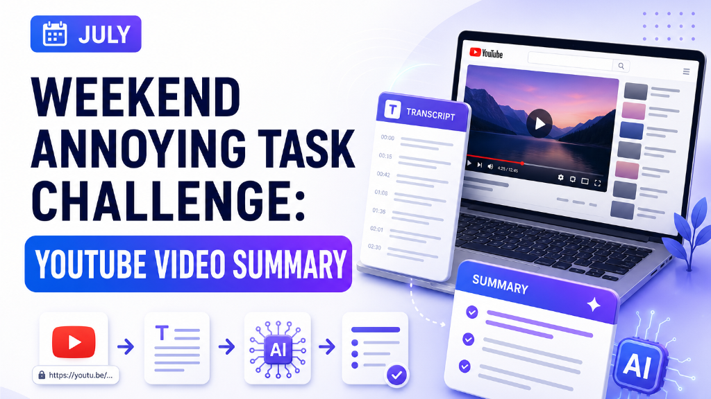
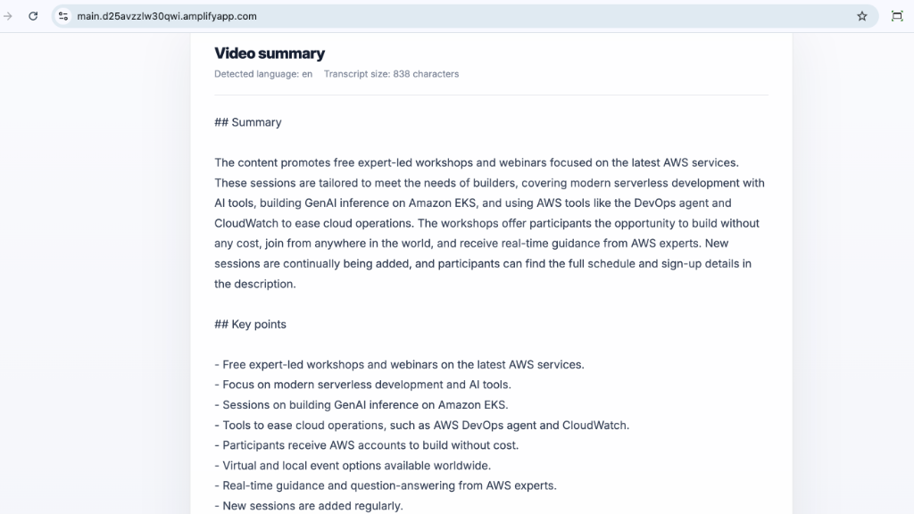

# Weekend Annoying Task Challenge: YouTube Video Summary

🌐 **Idioma:** [English](README.md) \| **Português**




| Propriedade | Valor |
|---|---|
| Região AWS | `us-east-1` |
| Modelo de IA | Amazon Nova Micro |
| Runtime | Python 3.13 |
| Frontend | React 19 / Vite 8 |
| Backend | AWS Lambda |
| API | AWS Lambda Function URL |
| Infraestrutura como código | AWS SAM / AWS CloudFormation |
| Provedor de transcrição | Supadata |
| Armazenamento do segredo | AWS Systems Manager Parameter Store |
| Hospedagem | AWS Amplify Hosting |

Aplicação serverless com inteligência artificial desenvolvida para o **AWS Weekend Challenge: Turn One Annoying Task into an App**.

O YouTube Video Summary recebe uma URL do YouTube, recupera a transcrição disponível, identifica seu idioma original e usa o Amazon Bedrock para gerar um resumo claro e estruturado nesse mesmo idioma.

A interface está disponível em inglês e português do Brasil. O inglês é selecionado por padrão.

> [!NOTE]
> O ambiente de produção é temporário e será removido após a publicação do desafio para evitar custos desnecessários na AWS.

---

## Visão e o que a aplicação faz

Assistir a um vídeo longo no YouTube antes de saber se ele é útil pode consumir um tempo valioso.

A ideia do **YouTube Video Summary** surgiu a partir dos trailers de filmes. Um trailer ajuda alguém a decidir se vale a pena assistir a um filme de duas horas. Eu queria aplicar esse mesmo atalho de decisão aos vídeos do YouTube.

Em vez de gastar imediatamente 30 minutos ou mais assistindo a um vídeo, o usuário pode primeiro ler um resumo estruturado e decidir se o conteúdo completo é relevante.

O usuário cola uma URL pública do YouTube. A aplicação recupera a transcrição disponível, identifica seu idioma e gera um resumo nesse mesmo idioma.


A aplicação fornece:

- um resumo objetivo;
- os principais pontos;
- uma conclusão;
- o idioma detectado na transcrição;
- a quantidade de caracteres da transcrição;
- acesso à transcrição completa;
- uma interface em inglês e português do Brasil.



---

## Como eu desenvolvi

Comecei definindo a menor arquitetura capaz de atender ao desafio sem adicionar infraestrutura desnecessária.

O frontend foi desenvolvido com **React 19** e **Vite 8**. Ele é hospedado com **AWS Amplify Hosting** e se comunica com o backend por meio de uma **AWS Lambda Function URL**.


O backend foi desenvolvido em **Python 3.13** e implantado com **AWS SAM**. A função Lambda:

1. valida a solicitação HTTP;
2. valida a URL do YouTube;
3. recupera a chave da API Supadata no AWS Systems Manager Parameter Store;
4. solicita a transcrição pública à Supadata;
5. identifica o idioma da transcrição;
6. invoca o Amazon Nova Micro por meio do Amazon Bedrock;
7. retorna o resumo estruturado e a transcrição ao frontend.

### Principais decisões

Escolhi uma arquitetura serverless para reduzir custos, simplificar a implantação e facilitar a remoção do ambiente após o desafio.

O projeto não utiliza:

- Amazon EC2;
- contêineres;
- Elastic Load Balancing;
- Amazon API Gateway;
- banco de dados;
- armazenamento persistente de transcrições;
- simultaneidade provisionada;
- rastreamento ativo do AWS X-Ray.

O Amazon Nova Micro foi escolhido por ser adequado para resumo de textos e por contribuir para uma arquitetura de menor custo.

A chave da API Supadata é armazenada como `SecureString` no AWS Systems Manager Parameter Store, em vez de ser inserida no frontend ou publicada no GitHub.


A função de execução do Lambda segue o princípio do menor privilégio. Ela pode invocar somente o modelo Amazon Nova Micro selecionado e recuperar apenas o parâmetro necessário no Parameter Store.

### Desafios e como foram resolvidos

#### Recuperação das legendas do YouTube

O primeiro desafio foi obter legendas públicas de forma confiável a partir de um backend hospedado na nuvem. Abordagens diretas para recuperar transcrições podem ser bloqueadas ou restringidas, enquanto o fluxo oficial de legendas do YouTube foi projetado para acesso autorizado.

Resolvi isso integrando a Supadata como provedora da transcrição.

#### Retorno do resumo no idioma correto

O modelo nem sempre preservava de forma consistente o idioma da transcrição.

Atualizei o prompt do backend para definir:

- o idioma obrigatório da saída;
- títulos obrigatórios;
- regras exatas de formatação;
- temperatura baixa de inferência;
- requisitos de saída estruturada.

Transcrições em inglês utilizam:

```text
## Summary
## Key points
## Conclusion
```

Transcrições em português utilizam:

```text
## Resumo
## Principais pontos
## Conclusão
```

#### Conexão do Amplify com o backend

O frontend lê a URL da função Lambda por meio da variável de ambiente do Amplify:

```text
VITE_API_URL
```


O CORS da URL da função Lambda está restrito ao domínio de produção do Amplify.


#### Controle do tamanho da solicitação e do uso do modelo

O MVP limita as transcrições a:

```text
80.000 caracteres
```

A resposta do Amazon Bedrock é limitada a 1.500 tokens de saída, e a temperatura do modelo foi definida como `0.1` para gerar resultados mais consistentes.

---

## Serviços AWS utilizados / Visão geral da arquitetura

### Serviços AWS

| Serviço AWS | Finalidade |
|---|---|
| AWS Amplify Hosting | Hospeda e implanta o frontend React e Vite |
| AWS Lambda | Processa a solicitação, recupera a transcrição, invoca o Amazon Bedrock e retorna o resultado |
| AWS Lambda Function URL | Fornece o endpoint HTTPS utilizado pelo frontend |
| Amazon Bedrock | Fornece inferência de inteligência artificial generativa por meio da API Converse |
| Amazon Nova Micro | Gera o resumo estruturado do vídeo |
| AWS Systems Manager Parameter Store | Armazena a chave da API Supadata como `SecureString` |
| Amazon CloudWatch Logs | Armazena os logs de execução do Lambda |
| AWS Identity and Access Management | Fornece permissões de menor privilégio para a função de execução do Lambda |
| AWS CloudFormation e AWS SAM | Definem e implantam a infraestrutura do backend |

### Serviço externo

| Serviço | Finalidade |
|---|---|
| Supadata | Recupera a transcrição pública do YouTube e identifica seu idioma |

### Como a aplicação é acionada

A aplicação é acionada quando o usuário:

1. abre a aplicação React hospedada no AWS Amplify;
2. informa uma URL do YouTube;
3. seleciona **Summarize**.

O navegador envia uma solicitação HTTPS `POST` para a Lambda Function URL. Essa solicitação invoca a função AWS Lambda.

A função Lambda recupera a transcrição por meio da Supadata, envia o conteúdo ao Amazon Nova Micro por meio do Amazon Bedrock e retorna o resumo gerado ao frontend.

### Fluxo da arquitetura

```text
Usuário
  |
  v
Aplicação web React + Vite
  |
  v
AWS Amplify Hosting
  |
  | HTTPS POST
  v
AWS Lambda Function URL
  |
  v
AWS Lambda
  |
  +--> AWS Systems Manager Parameter Store
  |       Chave da API Supadata
  |
  +--> Supadata
  |       Transcrição do YouTube e idioma
  |
  +--> Amazon Bedrock
          Resumo com Amazon Nova Micro

AWS Lambda
  |
  v
Amazon CloudWatch Logs
```

### Diagrama da arquitetura


---

## O que eu aprendi

Este desafio reforçou a importância de começar com a menor arquitetura necessária para resolver o problema.

Aprendi como:

- implantar um backend em Python com AWS SAM;
- expor uma função Lambda por meio de uma Lambda Function URL;
- conectar um frontend no AWS Amplify a um backend serverless;
- configurar corretamente o CORS em produção;
- armazenar com segurança uma chave de API externa no Parameter Store;
- aplicar permissões IAM de menor privilégio;
- invocar o Amazon Nova Micro por meio da API Converse do Amazon Bedrock;
- controlar a saída do modelo usando regras de idioma, títulos fixos, limites de tokens e temperatura baixa;
- projetar uma aplicação que não exige banco de dados;
- equilibrar simplicidade, segurança, custo e usabilidade em um projeto de fim de semana.

Também aprendi que a menor arquitetura funcional nem sempre é a primeira arquitetura considerada. Vários serviços e recursos foram removidos intencionalmente porque não eram necessários para o MVP.

O resultado final é uma aplicação serverless focada em resolver uma tarefa repetitiva: decidir se vale a pena assistir a um vídeo do YouTube antes de investir o tempo necessário para vê-lo por completo.

---

## Demonstração ao Vivo

Experimente a aplicação:

[Abrir o YouTube Video Summary](https://main.d25avzzlw30qwi.amplifyapp.com/)

> **Observação:** A demonstração ao vivo estará disponível por tempo limitado.

---

## Licença

Este projeto está licenciado sob a licença MIT. Consulte o arquivo [LICENSE](LICENSE) para obter mais detalhes.
